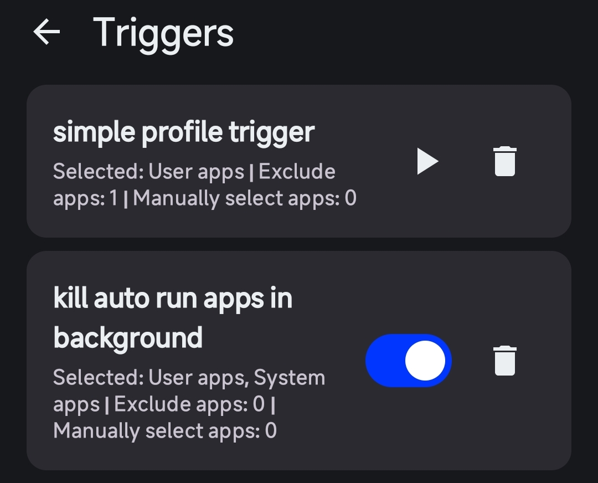
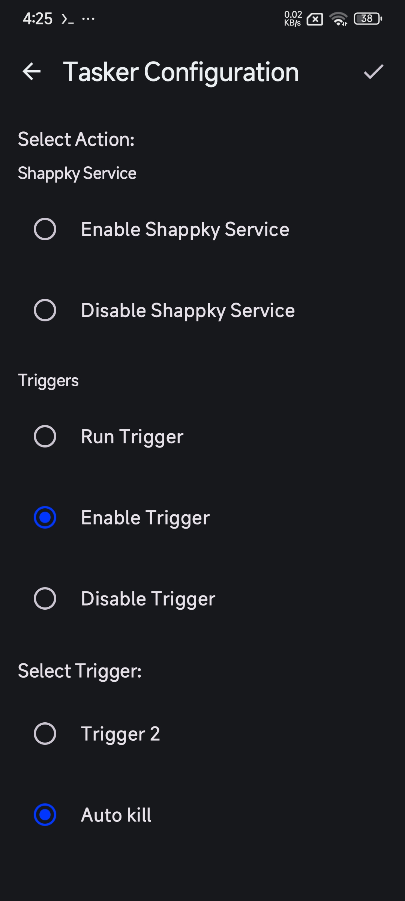
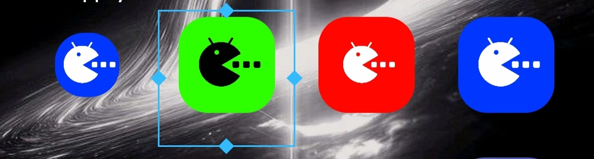
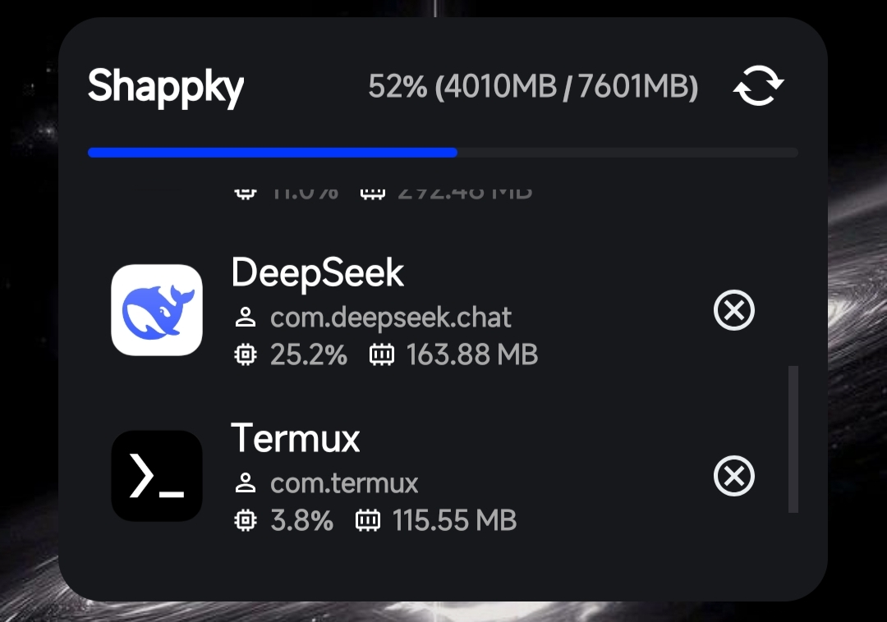

# Shappky

  
  
  

## What is Shappky?
*Shappky*, short for Shell App Killer, is an app that stops background applications using either Shizuku or Root permissions, improving device performance, reducing memory usage, and lowering heat in a lightweight and safe way.

## How does Shappky work?
*Shappky* relies heavily on shell commands to identify and kill applications. You can read more about it here: [how_shappky_works.md](docs/how_shappky_works.md)

## Features

- **Flexible Permissions**: Works with either Shizuku or Root access.
- **Simplified User Interface**: Practical and easy-to-use design.
- **Fast Performance**: Stops applications with high efficiency.
- **App Protection**: Ability to protect certain apps from being killed, such as Keyboard, Launcher, and core system services.
- **Quick Tile**: Activate the background service that automatically kills unused apps via a Quick Tile.
- **Trigger Support**:
  - **Service triggers**: Customize a new background service through rules.
  - **Profile triggers**: Instant execution to kill specific apps with one tap.
- **Tasker compatible**: Full support for integration and custom actions.
- **Intent**: Send commands from external apps.
- **Widgets**: Home screen widgets for quick control.

## Screenshots

  
  
  

## Shappky Service
The *Shappky* background service runs in the background to automatically stop active apps once enabled. General service options can be customized, though app-killing rules are not customizable within the service itself.
> Note: You can create a Service Trigger to customize app-killing rules if you want full control over the service behavior.

## Triggers
Triggers come in two types:
1. **Profile trigger**: This trigger must be executed manually, allowing you to select a specific group of apps.
2. **Service trigger**: This lets you create and customize a background service using available rules, with automatic enable/disable options based on those rules.

## Intent & Tasker Integration

### Intent
The app also supports Broadcast Intent.
1. Select Intent type : **Broadcast Intent**.
2. **Package**: `com.yassernull.shappky`
3. Select an **Action**:
   - To execute a profile trigger: `com.yassernull.shappky.EXECUTE_TRIGGER`
   - To enable a service trigger: `com.yassernull.shappky.ENABLE_TRIGGER`
   - To disable a service trigger: `com.yassernull.shappky.DISABLE_TRIGGER`
   - To enable Shappky service: `com.yassernull.shappky.ENABLE_SHAPPKY_SERVICE`
   - To disable Shappky service: `com.yassernull.shappky.DISABLE_SHAPPKY_SERVICE`
4. **Extra Key**: `TRIGGER_NAME` (enter the trigger name).

### Tasker
The app includes a plugin for Tasker integration.

1. Create a new Task.
2. Select the *Shappky* plugin.
3. Tap Configure.
4. Choose the action that suits your needs.

## Widgets

The app features 2 widgets:

1. **Action Widget**:
   You can create a 1x1 shortcut and assign a profile trigger to it. Tapping the widget will execute the trigger.
   

2. **App List Widget**:
   You can display a list of running background apps directly on your home screen with a one-tap kill feature.
   

## Requirements
- **Android Version**: 7.0 or higher.
- **Shizuku or Root**: *Shappky* requires Root or Shizuku permissions to work.

## Installation
You can download and install *Shappky* via one of the following methods:
**GitHub Releases**: Download the latest APK from the [Releases page](https://github.com/YasserNull/shappky/releases).

## License
*Shappky* is licensed under the [GNU General Public License v3.0](LICENSE).

## Donate
If you want to support me, I would be very grateful.

[**Ko-fi**](https://ko-fi.com/yassernull)
